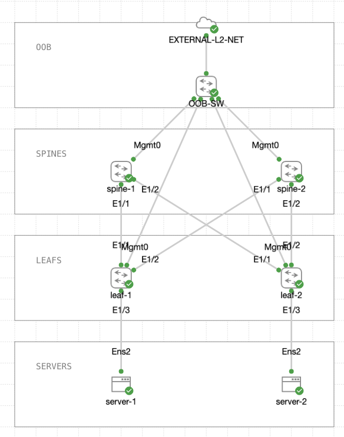

+++
title = 'BGP Based Data Center Fabric'
date = 2025-02-21T09:45:59+02:00
draft = false
+++

## Introduction

CLOS fabric using VLAN based access and BGP as the fabric routing procotol. The network is shown below. All switches are Cisco Nexus 9000v. Let's go. 



## Leaf Configuration

### Route-map

All switches have been configured with tagged IP addresses. Those tags are handy when redistributing routes to BGP. The approach saves the hassle of using network clauses and prefix-maps.

```
route-map REDISTRIBUTION-MAP permit 10
  match tag 12345 
```

### BFD

Since we are talking about just BGP combined with a CLOS fabric it makes sense to enable BFD on all fabric links. This way link failures can be detected quite fast and BGP neighbors taken down to ensure fast convergence.

```
feature bfd

int Ethernet1/1
  bfd interval 50 min_rx 50 multiplier 3
int Ethernet1/2
  bfd interval 50 min_rx 50 multiplier 3
```

### BGP

BGP is designed so that spines have their own AS number and leafs their own. Alternatively each leaf could have their own dedicated AS number. The con in that alternative is the need to allocate (potentially a lot of) unique AS numbers. On the other hand the pro is that we don't need to configure special BGP "knobs" to allow the routes to propagate properly. That said BGP setup is super clean in this case.

```
feature bgp

router bgp 65000
  router-id 1.0.0.3
  address-family ipv4 unicast
    redistribute direct route-map REDISTRIBUTION-MAP
    maximum-paths 4
  
  neighbor 10.0.1.1
    bfd
    remote-as 65010
    description SPINE-1
    update-source Eth1/1
    address-family ipv4 unicast
      ! Accept inbound routes that carry own AS number.
      allowas-in 3

  neighbor 10.0.2.1
    bfd
    remote-as 65010
    description SPINE-2
    update-source Eth1/2
    address-family ipv4 unicast
      allowas-in 3
```

## Spine Configuration

BGP configuration on spines is almost identical to leafs with one exception. 

```
feature bgp

router bgp 65010
  router-id 1.0.0.1
  address-family ipv4 unicast
    redistribute direct route-map REDISTRIBUTION-MAP
    maximum-paths 4
  
  neighbor 10.0.1.2
    bfd
    remote-as 65000
    description LEAF-1
    update-source Eth1/1
    address-family ipv4 unicast
      ! Allows outbound advertisement to an AS that's on path already
      disable-peer-as-check

  neighbor 10.0.1.6
    bfd
    remote-as 65000
    description LEAF-2
    update-source Eth1/2
    address-family ipv4 unicast
      disable-peer-as-check
```

## Lessons
